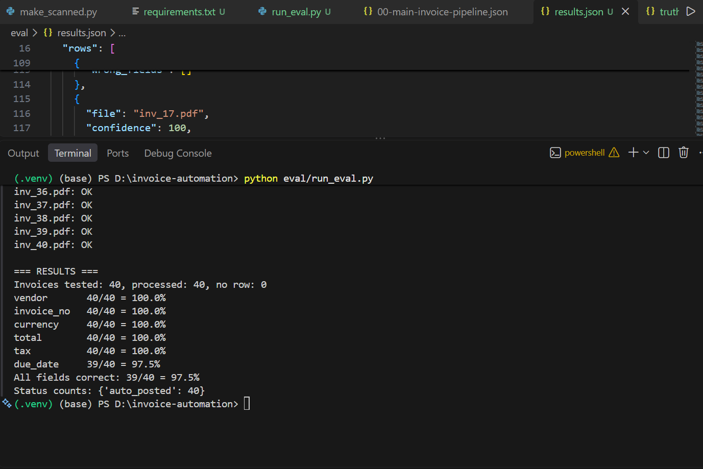

# Invoice Automation with Human-in-the-Loop Approval

A self-hosted invoice-processing pipeline built in **n8n**. It reads invoice PDFs (text or scanned), extracts structured data with an LLM, validates it with deterministic rules, blocks duplicates at the database level, auto-posts clean invoices, and routes uncertain ones to a human for approval. Every decision is written to an audit log.

**Result:** 39 of 40 synthetic test invoices extracted with every field correct (**97.5%**). See [Evaluation](#evaluation) for what that does and does not prove.

<!-- TODO: add a screenshot of the canvas, e.g. docs/canvas.png -->
[Main workflow](docs/Canvas.png)

---

## The problem

In many small companies, someone in finance reads each emailed invoice and types vendor, invoice number, amount and tax into a system. That causes typing errors, duplicate payments, payments to unknown vendors, and no record of who approved what.

This project automates the safe part and escalates the rest:

| Problem | How the pipeline handles it |
|---|---|
| Manual data entry | OCR and an LLM turn the PDF into structured JSON |
| Duplicate payments | A UNIQUE `dedupe_hash` in Postgres; the database refuses the second copy |
| Unknown vendors | Vendor master lookup; an unknown vendor always goes to human review |
| Misread numbers | Rule checks (totals reconcile, required fields present) produce a computed confidence score |
| Risky invoices posted blindly | Low-confidence invoices pause for Approve / Reject |
| No audit trail | Every outcome is recorded in `audit_log` with actor (system or human) |
| Silent failures | A global error workflow logs failures and sends an alert |
| AI cost surprises | Each LLM call is logged to `llm_calls` |

Supporting workflows (decoupled through Postgres, not linked on the canvas):

- **`90-global-error-handler`**: Error Trigger, logs to `workflow_errors`, emails an alert.
- **`91-weekly-report`**: Monday schedule, reads the tables, emails counts, auto-post rate, value posted, LLM spend and error count.

### Stack

| Layer | Choice |
|---|---|
| Orchestration | n8n (self-hosted, Docker) |
| Database | Postgres 16 (n8n's own DB plus business tables) |
| OCR | Small FastAPI service using PyMuPDF and Tesseract, run in Docker |
| LLM | OpenAI `gpt-4o-mini` |
| Approval | Gmail "Send and Wait for Response" |

## Design decisions

1. **The LLM reads, rules decide.** The model only extracts fields. Confidence is computed from checks (required fields, line items vs subtotal or total within a rupee of round-off, subtotal + tax vs total, vendor known). It is never taken from the model's own opinion.
2. **Hard rules beat scores.** An unknown vendor always goes to review, however clean the numbers are. The routing decision lives in one Code node (`route`, `route_reason`), so the IF node only compares two strings.
3. **Idempotency in the database, not in n8n logic.** `dedupe_hash` is UNIQUE and the insert uses `ON CONFLICT DO NOTHING`, so a double trigger or re-upload cannot create a second row.
4. **Never trust LLM output.** The reply is stripped of code fences, parsed, and validated before anything is saved.
5. **OCR only when needed.** Text PDFs are parsed directly. Only scans go to the local Tesseract service, so OCR costs nothing in API credit.
6. **Fail loudly.** The OCR service returns 422 on unreadable input, so the error workflow catches it instead of sending empty text to the LLM.
7. **Workflows decoupled through the database.** The weekly report reads what the pipeline wrote, so a failure in one never blocks the other.
8. **Validation tuned on real documents.** The first rules were too strict for GST invoices (round-off, tax-inclusive line amounts). Tolerances were added after testing against a real-style invoice.

## Database

Tables are created by `db/migrations/001_init.sql`: `vendors`, `invoices` (with `dedupe_hash UNIQUE`), `audit_log`, `llm_calls`, `workflow_errors`.

## Repository layout

```
invoice-automation/
├── docker-compose.yml
├── .env.example
├── requirements.txt            # local scripts (reportlab, requests, pymupdf)
├── workflows/
│   ├── 00-main-invoice-pipeline.json
│   ├── 90-global-error-handler.json
│   └── 91-weekly-report.json
├── db/migrations/001_init.sql
├── services/pdf-parser/        # OCR service (FastAPI + Tesseract)
├── scripts/make_scanned.py     # turns a PDF into an image-only PDF for OCR tests
└── eval/
    ├── samples/                # 40 synthetic invoices
    ├── truth.json              # ground truth
    ├── generate_samples.py
    ├── run_eval.py
    └── results.json
```

## Setup (Windows PowerShell)

Requires Docker Desktop, Git and Python 3.

1. **Configure environment**
   ```
   copy .env.example .env
   ```
   Edit `.env`: set a simple alphanumeric `POSTGRES_PASSWORD` and a random 40-character `N8N_ENCRYPTION_KEY`. Keep that key; saved credentials cannot be decrypted without it. No quotes and no spaces around `=`.
2. **Start the stack**
   ```
   docker compose up -d --build
   docker compose ps
   ```
   Open http://localhost:5678 and create the owner account.
3. **Create the tables**
   ```
   Get-Content db\migrations\001_init.sql | docker compose exec -T postgres psql -U n8n -d n8n
   ```
4. **Import the workflows**
   ```
   docker compose exec n8n n8n import:workflow --separate --input=/workflows/
   ```
5. **Create credentials in n8n** (they are not stored in the JSON):
   - Postgres: host `postgres`, port `5432`, database, user and password from `.env`.
   - OpenAI: your API key. Set a monthly spending limit in the OpenAI dashboard first.
   - Gmail OAuth2: client ID and secret from Google Cloud; redirect URI `http://localhost:5678/rest/oauth2-credential/callback`; add your address as a test user.
6. **Wire up and publish**
   - Re-select credentials on the nodes of each imported workflow.
   - In the main workflow's settings, set **Error Workflow** to `90-global-error-handler`.
   - Publish the main workflow so the webhook is live.
7. **Test the OCR service**
   ```
   curl.exe http://localhost:8000/health
   ```

## Evaluation

40 synthetic invoices (two layouts with different labels and date formats, INR and USD, with and without due dates) were sent through the webhook and compared field by field with `eval/truth.json`.

| Field | Correct |
|---|---|
| vendor | 40/40 (100%) |
| invoice_no | 40/40 (100%) |
| currency | 40/40 (100%) |
| total | 40/40 (100%) |
| tax | 40/40 (100%) |
| due_date | 39/40 (97.5%) |
| **All fields correct** | **39/40 (97.5%)** |

All 40 were auto-posted, because the sample vendors were in the vendor table.


**Cost:** <!-- TODO: fill in from `SELECT sum(cost_usd), count(*) FROM llm_calls` and confirm against the OpenAI usage dashboard -->

To reproduce:
```
pip install -r requirements.txt
docker compose exec postgres psql -U n8n -d n8n -c "INSERT INTO vendors (name) VALUES ('Verma Kirana Traders'),('Gupta Office Supplies'),('Rao Electronics'),('Northwind Stationers'),('Bluepeak Logistics') ON CONFLICT DO NOTHING;"
python eval\run_eval.py
```
`run_eval.py` truncates `invoices` and `audit_log`, so only run it on a development database.

### What this result does not show

- The invoices are **synthetic and clean** (text PDFs from two simple templates). Real vendor invoices with logos, stamps and irregular tables will score lower.
- Because every sample vendor was known, this run measures **extraction**. It does not yet measure the safety rules (unknown vendor, wrong totals, missing fields) on a dedicated test set.
- The scanned-invoice path was tested manually, not as part of the 40.

## Known limitations

- **Trigger:** invoices enter through an upload form and a webhook. A Gmail trigger is not wired in. It would replace the form without changing the nodes after `Extract PDF Text`.
- **Webhook security:** the evaluation webhook has no authentication. Remove it or add auth before exposing the instance.
- **No invoice-type gate:** any PDF that reaches the webhook is sent to the LLM. A keyword check before `LLM Extract` would filter non-invoices.
- **One invoice per run.** No accounting-system integration, and no payment step.
- **Approval links** point to `localhost`, so they work only on the machine running Docker.
- **Thresholds are judgment calls.** The score threshold of 80 and the validation tolerances should be tuned on real data.
- **Google OAuth in testing mode** expires its token after 7 days; re-authorize the Gmail credential.
- **OCR quality** depends on scan quality; English only.

## Roadmap

- Gmail trigger with sender and subject filters, plus an invoice-detection gate
- Dedicated safety test set (unknown vendor, wrong total, duplicate, missing invoice number)
- Split the main workflow into sub-workflows
- Telegram or Slack approval
- Deploy to a VPS behind HTTPS with nightly `pg_dump` backups

